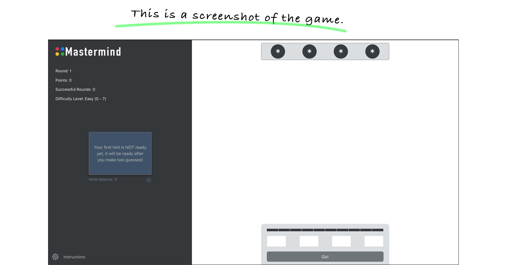

# Mastermind

[Mastermind Website!](https://master.d3bmjn4idj74od.amplifyapp.com/)

Created By: Hindreen Abdullah

[Portfolio!](https://www.hindreen.net/)

[LinkedIn](https://www.linkedin.com/in/hndfaw/)

## About

This is a game where you try to guess the number combinations. At the end of each attempt to guess the 4 number combinations, the computer will provide feedback whether you had guess a number correctly, and/or a number and digit correctly. You must guess the right number combinations within 10 attempts to win the game.

## Project Tech Used

- React
- React Router
- AWS (Amazon Web Services)
- Bootstrap

## Extensions to be added:

1. Make the game responsive; currently, the game is responsive but player cannot have the same experience as they would playing on desktop.

2. User authentication to track and save game progress for each user.

3. Give users the option to change numbers to colors when they play the game.

4. Add timer to the game.

## Game rules

1. At the start of the game the computer will randomly select a pattern of four different numbers from a total of 8 different numbers.

1. You will have 10 attempts to guess the number combinations

1. At the end of each guess, computer will provide one of the following response

as feedback:
 1. your guess was incorrect
  1. You had one correct number in wrong location
   1. You had guessed one correct number and its correct location
 1. You had X correct numbers and Y correct location/s.
 1. You found the CORRECT code.

1. Duplicate numbers are allowed
1. There are hints to help you win. Every round you play, you will get three hints. The hints will be available after you make your second guess, and you only can use one hint per guess. After you click on the hint, it will only last for 6 seconds then the card will flip back, so you will need to read it before it goes away.

1. You can collect points throughout the game. Every time you successfully crack the code, you will get points. The number of points will depend on how many guesses you use before you find the code. If you have a correct guess in the first try, you will get 100 points, if you get it in the second try you will get 90 points. Every time you use a guess you lose 10 points

1. By default, the game difficulty level is set to Easy, which means you can choose numbers between 0 - 7. However, you can change this in the settings to make the game more challenging. Other available levels are: Medium (0 - 14), Hard (0 - 28) and Harder (0 - 56)

To learn more, visit:

[Mastemind Website Instructions page](https://master.d3bmjn4idj74od.amplifyapp.com/instructions)

## To View Mastermind on Your Computer Clone down this Repo

###  In your terminal do the following steps; and hit return/enter after each step:

`git clone https://github.com/hndfaw/mastermind.git mastermind`

`cd mastermind`

`npm install`

`npm start`

Runs the app in the development mode.

Open http://localhost:3000 to view it in the browser.

## Project Screenshots:

