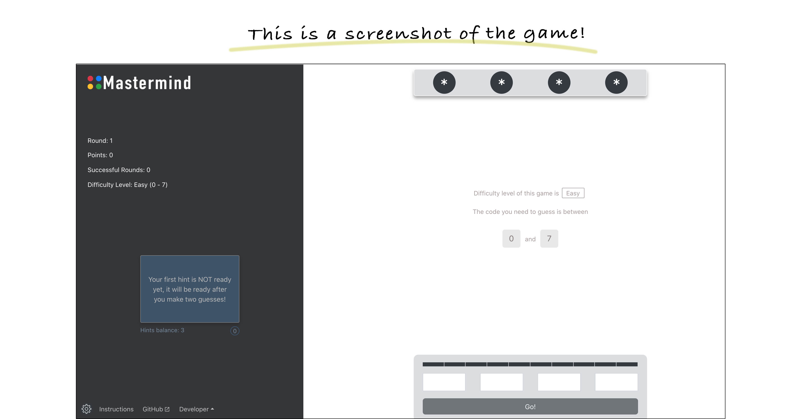

# Mastermind

[Mastermind Live Website!](https://master.d3bmjn4idj74od.amplifyapp.com/)

Created By: Hindreen Abdullah

[Portfolio!](https://www.hindreen.net/)

[LinkedIn](https://www.linkedin.com/in/hndfaw/)

## About

This is a game where you try to guess the number combinations. At the end of each attempt to guess the 4 number combinations, the computer will provide feedback whether you had guess a number correctly, and/or a number and digit correctly. You must guess the right number combinations within 10 attempts to win the game.

To learn how to play, please visit:

[Mastemind Website Instructions page](https://master.d3bmjn4idj74od.amplifyapp.com/instructions)

## Project Tech Emphasis

- React
- React Router
- AWS (Amazon Web Services)
- Bootstrap

## To View Mastermind on Your Computer Clone down this Repo

###  Copy this line in your terminal and hit enter:

`git clone https://github.com/hndfaw/mastermind.git`

`cd mastermind`

`npm install`

`npm start`

Runs the app in the development mode.

Open http://localhost:3000 to view it in the browser.

## Extensions to be added:

1. Make the game responsive; currently, the player cannot play on their small screens like phones.

2. User authentication to track and save game progress for each user.

3. Give users the option to change numbers to colors when they play the game.

## Project Screenshots:

